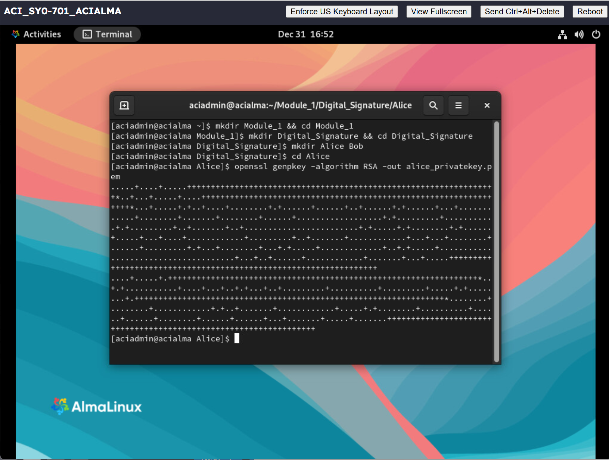
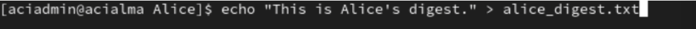
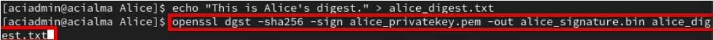
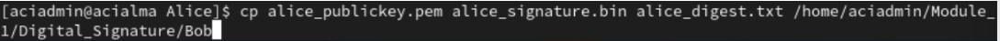
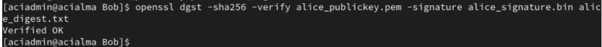

## Overview
The purpose of Lab 1 (Create and Verify a Digital Signature) is to demonstrate how digital signatures are used to verify the authenticity and integrity of digital documents, messages, and transactions.

In this lab, public and private key pairs were generated, a digital signature was created using a private key, and the signature was verified using the corresponding public key. This process simulated a real-world scenario where one party signs data and another party verifies that the data has not been altered and that it came from the expected sender.

The lab was conducted using AlmaLinux 9.1 on a standalone Linux server. The OpenSSL cryptographic tool was used to generate RSA key pairs, create message digests, sign data, and verify digital signatures.

Through this lab, key skills were developed in public key cryptography, hashing, digital signature creation, and signature verification. The lab also reinforced an understanding of how private and public keys work together to provide security.

This lab is important because digital signatures are widely used in real-world security applications such as secure email, software distribution, financial transactions, and authentication systems to ensure data integrity and verify identity.

## Steps Performed

### Part 1- Creating a Private and Public Key

The directories Digital_Signature, Alice, and Bob were created. In the Alice directory, a private key was created. 

The RSA algorithm was used to make the key for Alice, which will then be later used to encrypt, decrypt, or for digital signatures. 

This command creates a public key from the private key we created for Alice. 

### Part 2- Creating a Digital Signature

The command creates a digest file that is hashed, and the resulting hash is encrypted using Alice’s private key to form the digital signature.

This command creates Alice's digital signature by hashing the alice_digest.txt file and encrypting the hash output with alice_privatekey.pem. The resulting file (which is the signature file) is alice_signature.bin. 

### Part 3- Receiving and Verifying the Digital Signature 

This command simulates sending the files Alice's public key, the signature file, and the digest to Bob. 

### Part 4- Verifying Alice's Digital Signature (Last Part)

This command verifies Alice's digital signature and we received "Verified OK" for confirmation. 

